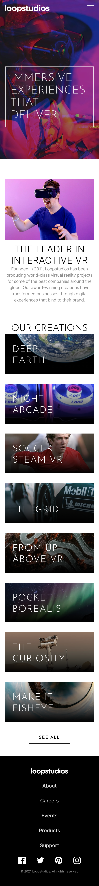

# LoopStudios Landing Page 🌐

This is a fully responsive and interactive landing page for a VR company called **LoopStudios**, built with **React** and **Tailwind CSS**.

## Features 🚀

- ⚡ Fully responsive design
- 🎨 Styled with Tailwind CSS
- ⚛️ Built with React
- 📱 Mobile-first approach
- 🔥 Modern and interactive UI

## 🛠️ Technologies Used

- **React** (Component-based architecture)
- **Tailwind CSS** (Utility-first styling)

## Screenshots 📸

### Desktop View


### Mobile View



## Installation & Setup 🛠

To run this project locally, follow these steps:

1. Clone the repository:

   ```sh
   git clone https://github.com/Stevesadr/LoopStudios.git
   ```

2. Navigate to the project folder:
   ```sh
   cd loopstudios
   ```
4. Install dependencies:
   ```sh
   npm install
   ```
6. Start the development server:
   ```sh
   npm run dev
   ```
## Live Demo 🌍

## Acknowledgments 🙌

This project is based on a challenge from [Frontend Mentor](https://www.frontendmentor.io/).  
The original design idea belongs to them, and I have built it using React and Tailwind CSS.

# 🌟 Show Your Support!

If you like this project, please ⭐️ the repository to help it grow!
